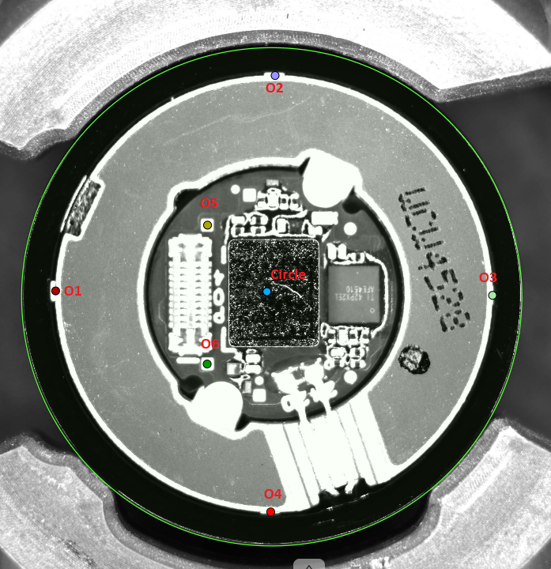
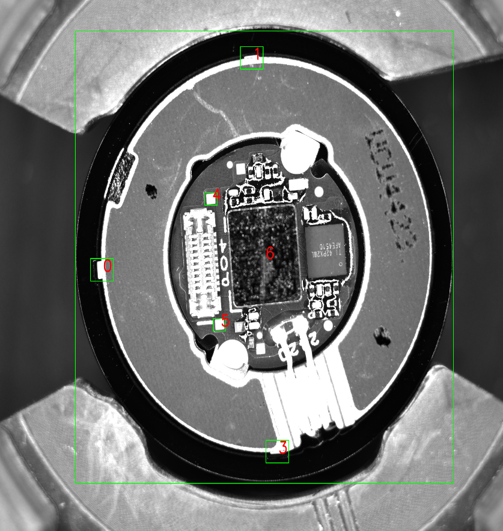
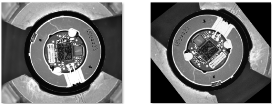
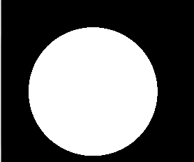

# Align

## Gán nhãn dữ liệu  

Gồm 7 đối tượng gán nhãn:  

   

- Điểm: O1, O2, O3, O4, O5, O6  
- Hình tròn: Circle

Cvat project setting: 


`
[
  {
    "name": "circle",
    "id": 2537094,
    "color": "#83e070",
    "type": "ellipse",
    "attributes": []
  },
  {
    "name": "o1",
    "id": 2537095,
    "color": "#801a0e",
    "type": "points",
    "attributes": []
  },
  {
    "name": "o2",
    "id": 2537096,
    "color": "#9b93f6",
    "type": "points",
    "attributes": []
  },
  {
    "name": "o3",
    "id": 2537097,
    "color": "#aed3b2",
    "type": "points",
    "attributes": []
  },
  {
    "name": "o4",
    "id": 2537098,
    "color": "#ed0e00",
    "type": "points",
    "attributes": []
  },
  {
    "name": "o5",
    "id": 2537099,
    "color": "#9f9a09",
    "type": "any",
    "attributes": []
  },
  {
    "name": "o6",
    "id": 2537100,
    "color": "#0e8312",
    "type": "any",
    "attributes": []
  },
  {
    "name": "o7",
    "id": 2537101,
    "color": "#1796d5",
    "type": "any",
    "attributes": []
  },
  {
    "name": "o8",
    "id": 2537102,
    "color": "#af8737",
    "type": "any",
    "attributes": []
  },
  {
    "name": "o9",
    "id": 2537103,
    "color": "#e532f4",
    "type": "any",
    "attributes": []
  },
  {
    "name": "o10",
    "id": 2537104,
    "color": "#5ab0be",
    "type": "any",
    "attributes": []
  },
  {
    "name": "o11",
    "id": 2537105,
    "color": "#9b9507",
    "type": "any",
    "attributes": []
  },
  {
    "name": "o12",
    "id": 2537106,
    "color": "#94626d",
    "type": "any",
    "attributes": []
  },
  {
    "name": "bigchip",
    "id": 2537107,
    "color": "#5cd1e1",
    "type": "any",
    "attributes": []
  },
  {
    "name": "tl",
    "id": 2537108,
    "color": "#7ea329",
    "type": "any",
    "attributes": []
  },
  {
    "name": "bl",
    "id": 2537109,
    "color": "#5d68bd",
    "type": "any",
    "attributes": []
  }
]
`

## Data  
### Định dạng dữ liệu CVAT

#### 1. Với điểm:   
`<points label="o2" source="manual" occluded="0" points="1324.11,217.17" z_order="0">  
`  
Thẻ points và dữ liệu nằm ở points="1324.11,217.17" theo format points="x, y"
#### 2. Với đường tròn  
`<ellipse label="circle" source="manual" occluded="0" cx="1308.60" cy="920.50" rx="795.15" ry="789.05" z_order="0">
    </ellipse>`

Tâm của đường tròn là cx, cy, bán kính là (rx + ry)/2

### Mô hình phát hiện điểm
   

#### Coi 7 đổi tượng gồm 6 điểm và 1 đường tròn là các đối tượng trong bài toán Object detection. Mỗi đối tượng được bao bọc bởi 1 bouding box (như trên hình).  
(Bouding box được biểu diễn bằng 4 tham số x_center, y_center, w, h)  
(*) Do góc lắp dặt camera, các đối tượng luôn có kích thước không đổi so với khung hình

#### 1. Công thức biến đổi đối tượng:   
##### Với điểm  O1, O2, O3, O4  
là 4 tai của main board phía sau.  
Đưa dạng điểm của O1, O2, O3, O4 về dạng bouding box bằng công thức sau:  

```
x_center, y_center = x, y (x và y của points)  
w, h =  100/w, 100/w
```
https://github.com/cuongdtone/Align/blob/main/tools/cvat2yolo_lmk.py#L195

Các điểm O1, O2, O3, O4 được mặc định là kích thước 100 pixel so với toàn khung hình.

##### Với điểm  O5, O6  
Đưa dạng điểm của O5, O6  về dạng bouding box bằng công thức sau:  

```
x_center, y_center = x, y (x và y của points)  
w, h =  55/w, 55/w
```
https://github.com/cuongdtone/Align/blob/main/tools/cvat2yolo_lmk.py#L193

Các điểm O5, O6 được mặc định là kích thước O5, O6   pixel so với toàn khung hình.

#### 2. Sử dụng code để chuyển đổi dữ liệu CVAT về YOLO trong mô hình điểm
https://github.com/cuongdtone/Align/blob/main/tools/cvat2yolo_lmk.py  
Code được thiết kế để chạy đa luồng:   
Lớp CvatDataset: Đọc dữ liệu CVAT và chuyển đổi về YOLO  
```
data1 = CvatDataset(<đường dẫn tới file xml cvat>, <đường dẫn tới thư mục ảnh>)
data1.run(<đường dẫn lưu dữ liệu YOLO>, <tên tập dữ liệu>)
```
https://github.com/cuongdtone/Align/blob/main/tools/cvat2yolo_lmk.py#L232-L235

Sau khi chạy hàm run, dữ liệu YOLO được sinh ra và ghi vào thư mục đích.

Trong quá trình run, dữ liệu sẽ được tăng cường bằng bộ tăng cường sau: 
1. xoay hình ảnh theo góc ngẫu nhiên:


Các tọa độ đối tượng cũng được xác định lại sau khi xoay
https://github.com/cuongdtone/Align/blob/main/tools/cvat2yolo_lmk.py#L51

2. Bộ lọc tăng cường bằng imgaug
https://github.com/cuongdtone/Align/blob/main/tools/cvat2yolo_lmk.py#L15-L33

Các bộ lọc thêm nhiễu, làm mờ ... được thêm vào  
Nếu các điều kiện trên là chưa đủ, hãy tham khảo https://github.com/aleju/imgaug để đưa thêm các hiệu ứng cần thiết.   
Giả sử: Muốn thêm độ sáng, hãy xem xét lớp Add và thêm vào seq:  
```
seq = iaa.Sequential([
    .....
    iaa.Add((-40, 40)) # độ sáng giảm -40 cho tới +40
])
```
#### 3. Để kích hoạt chế độ đa luồng, đặt hàm run ở executor

```
data2 = CvatDataset(r'train-cvat-circle\set1-100-annotations.xml', r'../SyntheticData2')
executor.submit(data2.run, out, "B")
```

Thêm các tập dữ liệu executor theo mẫu trên, sau đó khởi chạy:  
```python tools/cvat2yolo_lmk.py```

Khi hoàn tất, có thể dùng  
```python tools/y8-dataset-review-lmk.py```   
để xem xét và review lại dữ liệu đã được tạo


### Mô hình phát hiện đường tròn

Dữ liệu  


Bài toàn được dùng là phân đoạn hình ảnh, đưa đường tròn về binary mask và sử dụng YOLO để huấn luyện.   
#### Dữ liệu  
https://github.com/cuongdtone/Align/blob/main/tools/cvat2yolo_circle.py

Tương tự với mô hình điểm. Mô hình đường tròn chỉ khác bước chuyển đổi dữ liệu: 
https://github.com/cuongdtone/Align/blob/main/tools/cvat2yolo_circle.py#L248-L254

Dùng định dạng dữ liệu YOLO RLE  
https://docs.ultralytics.com/datasets/segment/

Thêm các tập dữ liệu executor theo mẫu trên, sau đó khởi chạy:  
```python tools/cvat2yolo_circle.py```

Khi hoàn tất, có thể dùng  
```python tools/y8-dataset-review-circle.py```   
để xem xét và review lại dữ liệu đã được tạo

## Model Traning

```python y8-train-circle.py```  
```python y8-train-lmk.py```  